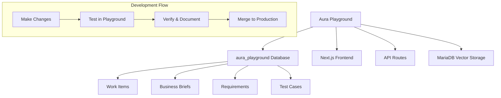

# 🎮 Aura Playground

**A complete development environment for Aura SDLC system experimentation and feature development.**

[](https://github.com/RowenGopi87/Aura-Playground)
[]()
[]()
[]()

## 🎯 What is Aura Playground?

Aura Playground is a **complete isolated environment** for developing and testing changes to the Aura SDLC system without affecting production data. It's your personal sandbox for:

- 🔬 **Experimenting** with new features safely
- 🛠️ **Testing** database modifications and API endpoints  
- 🚀 **Developing** in complete isolation from production
- 🎨 **Prototyping** new UI/UX improvements
- 🔄 **Merging** proven changes back to production

## 🏢 Enterprise Structure

This repository follows an enterprise-grade folder structure designed for scalability and maintainability:

```
Aura-Playground/
├── 📁 src/                    # Application source code
├── 📁 tools/                  # Development & database tools
├── 📁 config/                 # Configuration management
├── 📁 infrastructure/         # Infrastructure as Code
├── 📁 docs/                   # Documentation
├── 📁 tests/                  # Testing framework
├── 📁 temp/                   # Temporary & experimental files
├── 🚀 start-aura-with-mcp.bat # Main startup script
├── 🔄 fresh-start.bat         # Clean restart script
└── 📖 README.md               # This file
```

For detailed structure documentation, see [ENTERPRISE_STRUCTURE.md](./ENTERPRISE_STRUCTURE.md).

## ⚡ Quick Start

### 1. Set Up Your Playground Database

```powershell
# Automated setup (recommended)
tools\scripts\development\setup-playground.ps1

# Or manual database setup
tools\database\setup\setup.ps1
```

### 2. Configure Environment

```bash
# Copy environment template and configure
cp config\environment\env.template .env

# Edit .env file and set your values:
# - AURA_DB_PASSWORD=your_secure_password
# - OPENAI_API_KEY=your_openai_key (or GOOGLE_API_KEY)
```

### 3. Install Dependencies & Start

```bash
npm install
npm run dev
```

### 4. Verify Setup

```powershell
# Run comprehensive tests
tools\scripts\development\test-playground.ps1

# Or check manually
curl http://localhost:3000/api/database/health
```

## 🏗️ Architecture



## 🛠️ Key Features

### 🗄️ **Database Management**
- **Complete isolation** from production (`aura_playground` vs `aura_sdlc`)
- **Data cloning** capabilities from existing systems
- **Vector storage** support for RAG/AI features
- **MariaDB** optimized setup with proper indexing

### 🔧 **Development Tools**
- **Automated setup** scripts for Windows (PowerShell & Batch)
- **Testing suite** to verify environment integrity
- **Database health monitoring** endpoints
- **Migration utilities** for moving changes between environments

### 🧪 **Testing Environment**
- **Comprehensive test coverage** with Jest and Playwright
- **API endpoint testing** for all major functions
- **Database connection verification**
- **End-to-end workflow testing**

### 🚀 **Deployment Ready**
- **Environment configuration** management
- **MCP (Model Context Protocol)** integration support
- **RAG system** configuration for AI features
- **Docker** compatibility (MariaDB setup included)

## 📊 Project Structure

```
Aura-Playground/
├── 🎮 setup-playground.ps1       # Main setup script
├── 🗄️ database/setup/            # Database initialization
├── 🔧 scripts/                   # Utility scripts
├── 📱 src/app/                    # Next.js application
├── 🧪 tests/                     # Test suites
├── 🤖 mcp/                       # MCP server integration
├── 📖 docs/                      # Documentation
└── 🔍 PLAYGROUND_SETUP.md        # Complete setup guide
```

## 🚦 Development Workflow

### 1. **Playground Development**
```bash
# Make your changes in the playground environment
git checkout -b feature/new-awesome-feature
# ... make changes ...
git commit -m "✨ Add awesome new feature"
```

### 2. **Testing & Verification**  
```powershell
# Run all tests
.\test-playground.ps1
npm test
npm run test:e2e
```

### 3. **Ready for Production**
```bash
# Export schema/data changes if needed
mysqldump -u aura_user -p --routines aura_playground > changes.sql

# Merge back to production branch
git checkout main
git merge feature/new-awesome-feature
```

## 🌟 Key Differences from Production

| Aspect | Production | Playground |
|--------|------------|------------|
| **Database** | `aura_sdlc` | `aura_playground` |
| **Data Safety** | High caution required | Safe to experiment |
| **Testing** | Limited testing | Full test suite |
| **Changes** | Careful deployment | Rapid iteration |
| **Rollback** | Complex process | Simple git reset |

## 🔗 API Endpoints

### Core Endpoints
- 🏥 `/api/database/health` - Database connectivity check
- 📋 `/api/business-briefs/*` - Business brief management  
- 🎯 `/api/initiatives/*` - Initiative tracking
- 📖 `/api/requirements/*` - Requirements management
- 🧪 `/api/test-cases/*` - Test case management

### AuraV2 Endpoints
- 💡 `/api/aurav2/qualify/ideas` - Idea qualification
- 📊 `/api/aurav2/prioritize/portfolio` - Portfolio prioritization
- 🤖 `/api/aurav2/ai/*` - AI-powered features

### RAG System
- 💬 `/api/rag/chat` - RAG-powered chat
- 📤 `/api/rag/upload` - Document upload
- 📊 `/api/rag/status` - System status

## 🔧 Configuration Files

### Environment
```env
AURA_DB_NAME=aura_playground
AURA_DB_HOST=127.0.0.1
AURA_DB_USER=aura_user
AURA_DB_PASSWORD=aura_password_123
```

### Database Setup
- `database/setup/01-create-database.sql` - Database creation
- `database/setup/03-create-tables.sql` - Core tables
- `database/setup/04-create-vector-stores.sql` - Vector storage
- `database/setup/05-create-procedures.sql` - Stored procedures

## 📚 Documentation

- 📖 **[Complete Setup Guide](PLAYGROUND_SETUP.md)** - Detailed setup instructions
- 🗄️ **[Database Documentation](docs/DATABASE_SETUP.md)** - Database schema and setup
- 🧪 **[Testing Guide](tests/README.md)** - Testing framework documentation
- 🤖 **[MCP Integration](docs/guides/MCP_INTEGRATION_README.md)** - MCP server setup

## 🎯 Use Cases

### Perfect For:
- ✅ **New feature development**
- ✅ **Database schema changes**  
- ✅ **API endpoint modifications**
- ✅ **UI/UX experiments**
- ✅ **Performance optimizations**
- ✅ **Integration testing**

### Not Suitable For:
- ❌ Production data access
- ❌ Live customer interactions
- ❌ Production performance testing

## 🚨 Troubleshooting

### Common Issues

**Database Connection Failed**
```bash
# Check MariaDB service
net start mariadb

# Test connection
mysql -u aura_user -p -h 127.0.0.1
```

**Missing Tables**  
```powershell
# Re-run database setup
cd database/setup
.\setup.ps1
```

**Environment Issues**
```bash
# Verify .env configuration
cat .env | grep AURA_DB

# Test API health
curl http://localhost:3000/api/database/health
```

## 🤝 Contributing

1. **Fork** the playground repository
2. **Create** your feature branch (`git checkout -b feature/amazing-feature`)
3. **Test** thoroughly in the playground environment
4. **Commit** your changes (`git commit -m 'Add amazing feature'`)
5. **Push** to the branch (`git push origin feature/amazing-feature`)
6. **Open** a Pull Request

## 📄 License

This project is licensed under the MIT License - see the LICENSE file for details.

## 🙏 Acknowledgments

- Built on **Next.js** and **TypeScript**
- Database powered by **MariaDB**
- Vector storage for **RAG/AI** capabilities  
- **MCP integration** for enhanced tooling
- Comprehensive **testing suite** included

---

## 🚀 Ready to Start?

```powershell
# Quick setup command
.\setup-playground.ps1 && npm install && npm run dev
```

**Visit**: `http://localhost:3000` and start building! 🎉

---

*Happy coding in your new playground environment! 🎮✨*